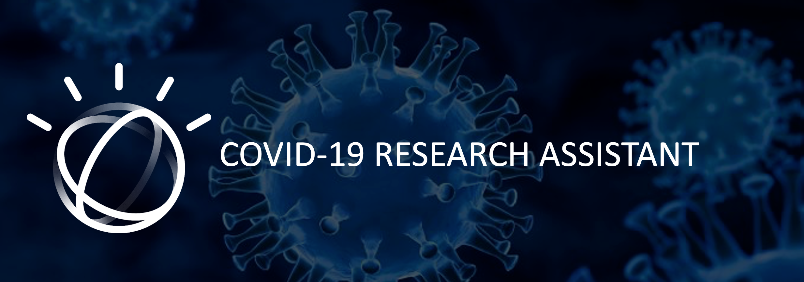

This project addresses the Crisis Communication COVID-19 challenge in Call for Code 2020.

## Contents

1. [Short description](#short-description)
1. [Demo video](#demo-video)
1. [The architecture](#the-architecture)
1. [Long description](#long-description)
1. [Blog](#blog)
1. [Project roadmap](#project-roadmap)
1. [Dataset](#Dataset)
1. [Getting started](#getting-started)
1. [Running the tests](#running-the-tests)
1. [Live demo](#live-demo)
1. [Built with](#built-with)
1. [Authors](#authors)
1. [License](#license)
1. [Acknowledgments](#acknowledgements)
1. [Resources](#resources)

## Short Description

### Problem Statement
Today scientists, researchers, doctors, and medical professionals face challenges when they look for answers to their high priority scientific questions.
The rapid acceleration in new coronavirus literature makes it difficult for the medical research community to Keep up. Therefore there’s a growing urgency for approaches in Natural Language Processing and AI to help medical professionals generate new insights in support of the ongoing fight against this infectious disease. 
### Objective
We aim to assist medical professionals to accelerate their work to help fight COVID19. This will help reduce search time for medical professional time by accessing a wider range of research resource. All the resources they need in one place. 
### Solution  
Our solution is an assistant that helps finding answers to the researchers' scientific questions. 
With Watson Discovery smart AI search engine, we have fed and trained our queries and rated the results with WD Machine learning. 
This task required a lot of reading and understanding the academic and scientific articles, we have built around 100 queries so far. 

## Demo Video

## The Architecture

1. The user interacts with Watson Assistant.
2. Watson Assistant Invokes Watson Discovery.
3. Watson Discovery finds the optimal results regarding the querries and responds to Assistant.
4. Watson Assistant displays the results to the User.

## Long Description

## Blog

https://medium.com/swlh/covid-19-research-assistant-using-ai-watson-discovery-to-analyze-open-research-dataset-by-kaggle-9807cf467626

## Project Roadmap

## Dataset

Kaggle has free accessible datasets related to COVID-19 Open Research Dataset (CORD-19). 
The Cord-19 resource offers more than 158,000 scholarly articles, including over 75,000 with full text, about COVID-19, SARS-CoV-2, and related coronaviruses. 

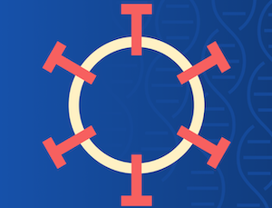 

We found these datasets useful to apply the Watson Discovery AI Search Engine on those articles. 

## Getting Started

1- Data analysis: clean the data from JSON files based on text-only: 

See the folder for details [data extraction](https://github.com/DevAdv-CFC20/COVID19-research-assistant/tree/master/Data%20Extraction)

2- Create new Discovery to start prepare for uploading: [Watson Discovery](https://cloud.ibm.com/catalog?search=Discovery#search_results) 

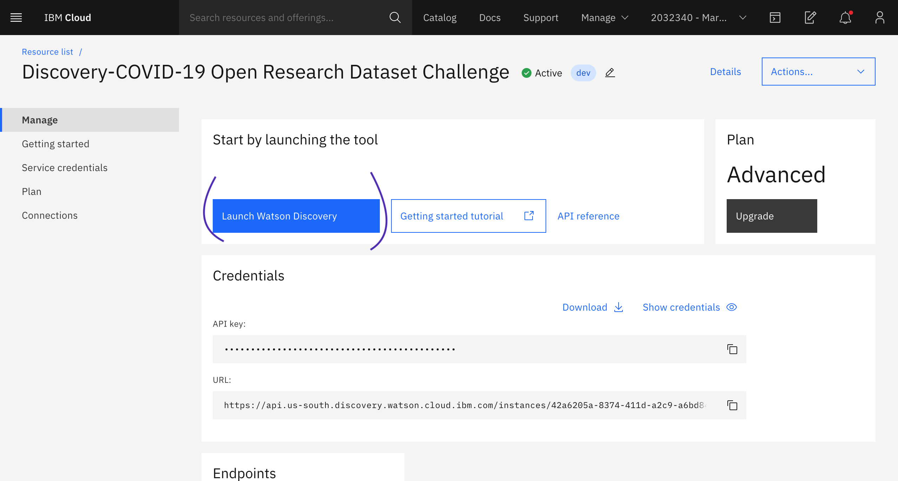 

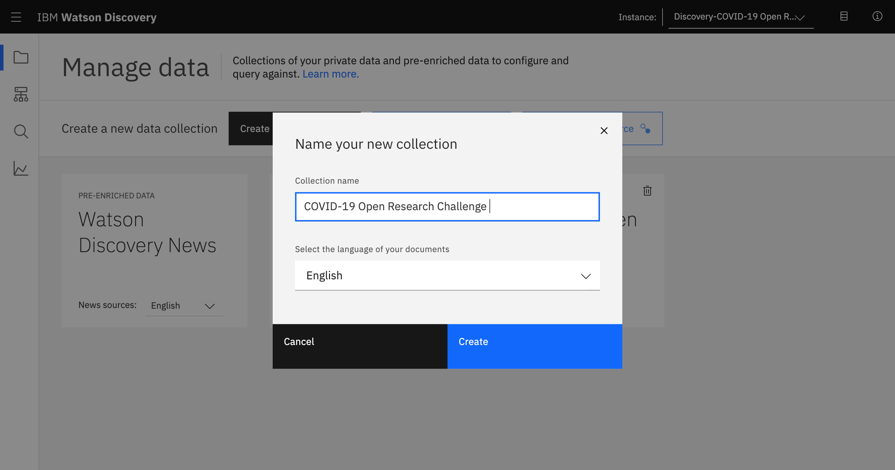 

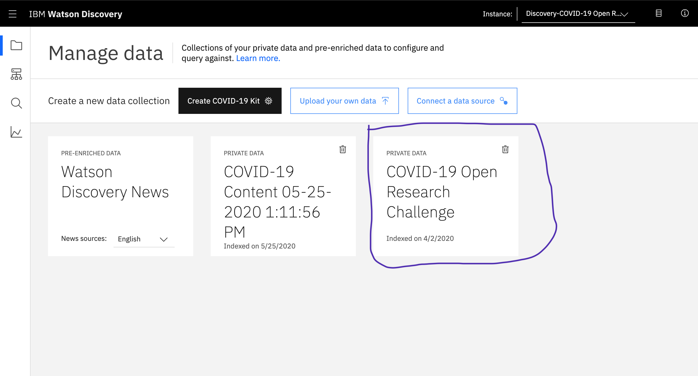 

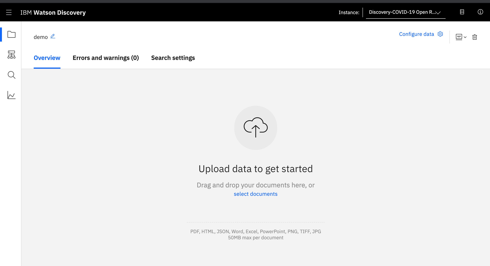 

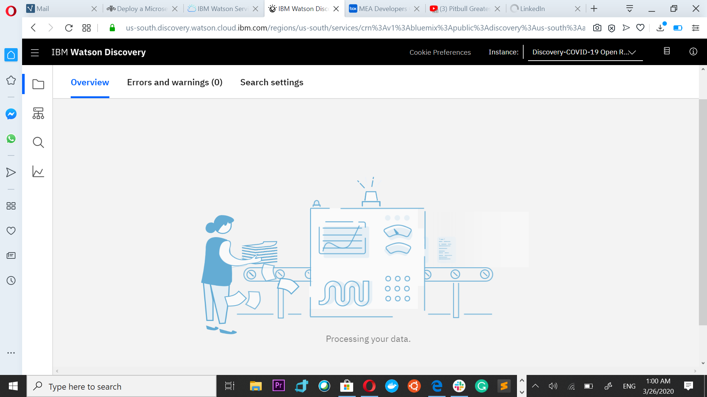 

we have only prepared “comm_use_subset” which it has 9,120 articles to feed inside Watson Discovery. 

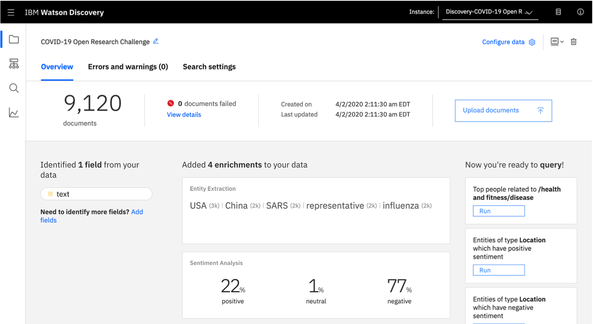 

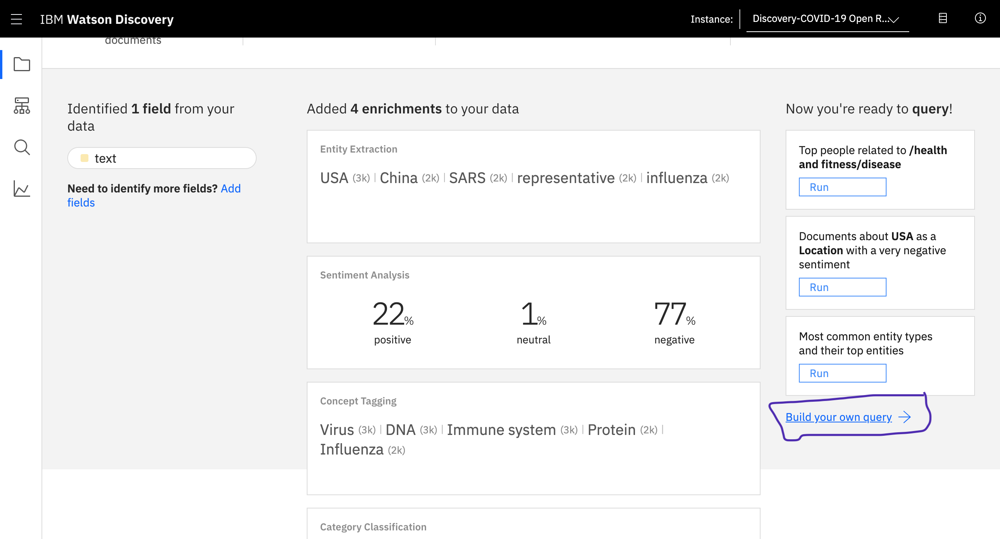 

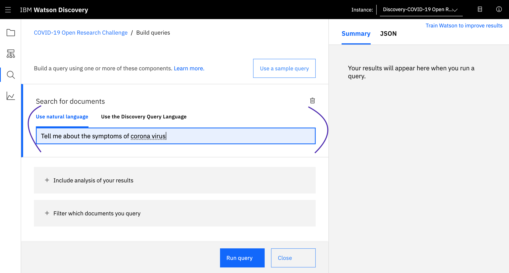 

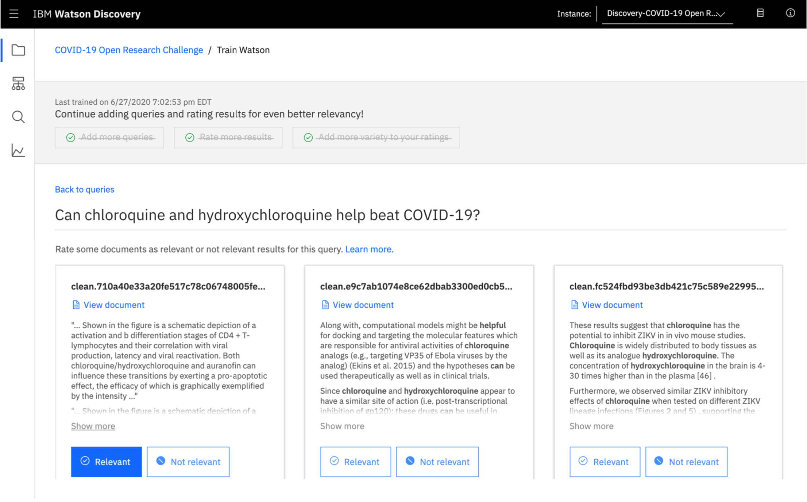 

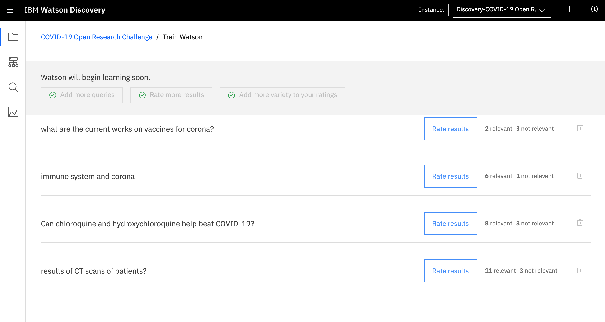 

With Watson Assistant conversation AI chatbot, we are have integrated WD with WA through webhook.  

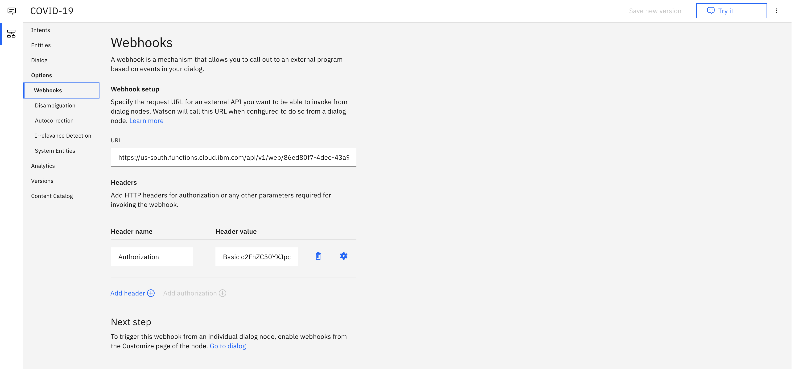

## Running the tests

## Live Demo

https://covid19cfcc.eu-gb.mybluemix.net/

## Built with

* [Watson Discovery](https://cloud.ibm.com/catalog?search=Discovery#search_results) - AI search engine used
* [Watson Assistant](https://cloud.ibm.com/catalog/services/watson-assistant) -  AI conversational platform used
* [IBM Cloud Functions](https://cloud.ibm.com/catalog?search=cloud%20functions#search_results) - The compute platform for handing logic
* [IBM DevOps Toolchain](https://cloud.ibm.com/catalog?search=Devops#search_results) -  developing and deploying the app used 

## Authors

Masa Abushamleh, Mofaq Althiyabi, Saad Tariq, Huzaifah Saleem

See the list of [collaborators]() who participated in this project.

## License

This project is licensed under the Apache 2 License - see the [LICENSE](LICENSE) file for details

## Acknowledgements

We would like to seize the opportunity to acknowledge and express our gratitude towards all those who extended their kind help in fulfilling this endeavor. We are grateful to [IBM] for the technology and resources, special thanks to Richard Hagarty for his technical support with Discovery. Nevertheless, we express our gratitude toward our families and colleagues for their kind co-operation and encouragement which help us in completion of this project.

## Resources

[1] https://www.kaggle.com/allen-institute-for-ai/CORD-19-research-challenge  
[2] https://www.semanticscholar.org/cord19  
[3] https://ai2-semanticscholar-cord-19.s3-us-west-2.amazonaws.com/historical_releases.html  
[4] https://www.statnews.com/2020/03/16/database-launched-to-spur-ai-tools-to-fight-coronavirus/  
[5] https://github.com/Call-for-Code/Solution-Starter-Kit-Communication-2020#the-idea  

