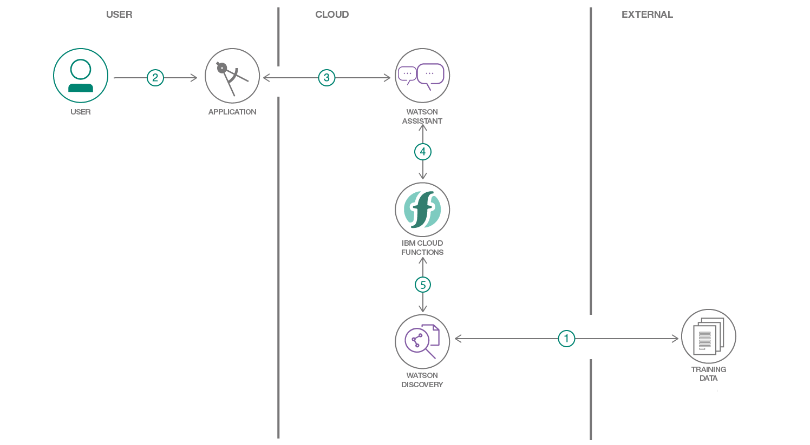

# COVID-19 Assistant 
IBM 2020 Call for Code Global Challenge

# project proposal:
https://github.ibm.com/IBMCode/IBMCodeContent/issues/4049 

# Collaborators: 
Huzaifah Saleem, Masa Abushamleh, Mofaq Althiyabi, Naiayrah Hussain ,Saad Tariq

# Problem Statement:
The rapid acceleration in new coronavirus literature, makes it difficult for the medical research community to keep up. Therefore there's a growing urgency for approaches in Natural Language Processing and AI to help medical professionals generate new insights in support of the ongoing fight against this infectious disease.

# Objective:
We aim to assist medical professional accelerate their work to help fight COVID-19.
# Architecture Diagram

# Solution
The Cord-19 resource offers more than 44,000 scholarly articles, including over 29,000 with full text, about Covid-19, Sars-CoV-2 and related coronaviruses. 

With this provided dataset, we are looking into building an assistant to assist medical professionals generate new insights, and discover patterns in a short time to accelerate the work in fighting COVID-19 and help treat the patients. 

With IBM Watson Discovery serivce , we are going to feed and train IBM  Watson Discovery Smart Document Understanding to analyze the dataset and then, we will build A robot chatbot that can help the medical community develop answers to high priority scientific questions. Also, This can help medical professionals accelerate their research on COVID-19. 

With IBM Watson Assistant service helps you build, train, and deploy conversational interactions into any application, device, or channel. Creating a chatbot using Watson Assistant can help address the issues that our users face while trying to gather accurate, relevant information. 

# Timeline

1. Building a collection of documents using Watson Discovery. 
2. Query the collection on Watson Discovery using natural language and train is using the relevancy score. 
3. Create a frontend application using Watson Assistant webhooks to allow the user to ask their queries in natural language, which send the request to the Discovery service. 
4. Finalize the Project.

### Resources:
•	https://www.kaggle.com/allen-institute-for-ai/CORD-19-research-challenge/tasks  
•	https://www.statnews.com/2020/03/16/database-launched-to-spur-ai-tools-to-fight-coronavirus/  
•	https://github.com/Call-for-Code/Solution-Starter-Kit-Communication-2020#the-idea 

# COVID19-research-assistant
