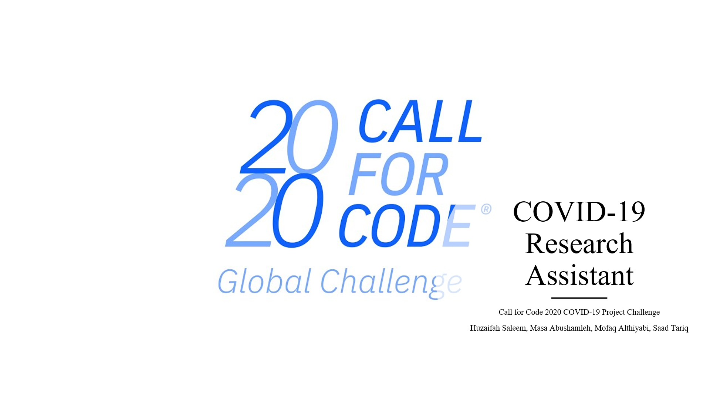

# Covid-19 Research Assistant

Call for Code 2020 Global Challenge

The project related to Crisis Communication COVID-19 initiative.

# Collaborators: 

Huzaifah Saleem, Masa Abushamleh, Mofaq Althiyabi, Saad Tariq

# Blog: 

https://medium.com/swlh/covid-19-research-assistant-using-ai-watson-discovery-to-analyze-open-research-dataset-by-kaggle-9807cf467626

# Proposal Video:

# Problem Statement:
Today scientists, researchers, doctors, and medical professionals are challenging to develop answers to their high priority scientific questions.
The rapid acceleration in new coronavirus literature makes it difficult for the medical research community to Keep Up. Therefore there’s a growing urgency for approaches in Natural Language Processing and AI to help medical professionals generate new insights in support of the ongoing fight against this infectious disease.

# Datasets Challenging:

Kaggle has prepared free accessible datasets related to COVID-19 Open Research Dataset (CORD-19).

The Cord-19 resource offers more than 158,000 scholarly articles, including over 75,000 with full text, about COVID-19, SARS-CoV-2, and related coronaviruses.

We found these datasets useful to apply the Watson Discovery AI Search Engine on those articles.

With this provided datasets 158,000 scholarly articles, we have only prepared “comm_use_subset” which it has 9,120 articles to feed inside Watson Discovery.

# Objective:

We aim to assist medical professionals to accelerate their work to help fight COVID19. This will be reducing medical professional time by accessing a wider range of research resources in a short period of time. All the resources they need in one place.

# Architecture Diagram

# Solution  
The Cord-19 resource offers more than 57,000 scholarly articles, including over 45,000 with full text, about Covid-19, Sars-CoV-2 and related coronaviruses. 

With this provided dataset, we are looking into building an assistant to assist medical professionals generate new insights, and discover patterns in a short time to accelerate the work in fighting COVID-19 and help treat the patients. 

With IBM Watson Discovery serivce , we are going to feed and train IBM  Watson Discovery Smart Document Understanding to analyze the dataset and then, we will build A robot chatbot that can help the medical community develop answers to high priority scientific questions. Also, This can help medical professionals accelerate their research on COVID-19. 

With IBM Watson Assistant service helps us build, train, and deploy conversational interactions into any application, device, or channel. Creating a chatbot using Watson Assistant can help address the issues that our users face while trying to gather accurate, relevant information. 

### Resources:
•	https://www.kaggle.com/allen-institute-for-ai/CORD-19-research-challenge/tasks  
•	https://www.statnews.com/2020/03/16/database-launched-to-spur-ai-tools-to-fight-coronavirus/  
•	https://github.com/Call-for-Code/Solution-Starter-Kit-Communication-2020#the-idea 

