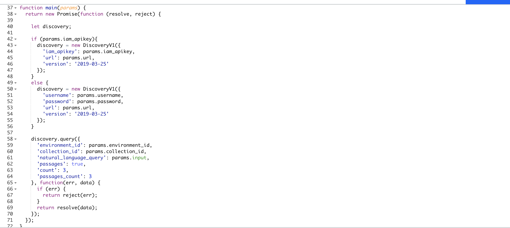
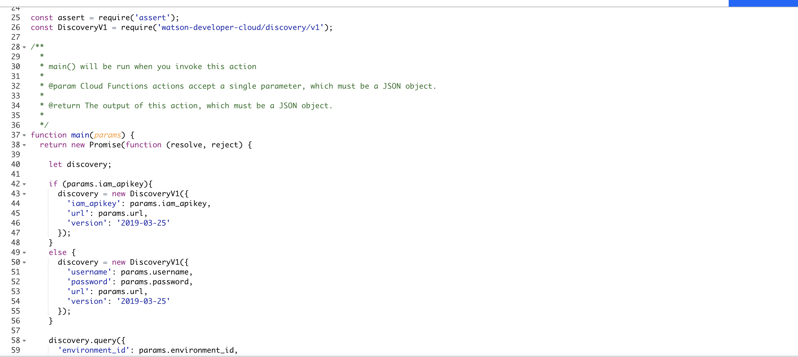

This project addresses the Crisis Communication COVID-19 challenge in Call for Code 2020.

## Contents

1. [Short description](#short-description)
1. [Demo video](#demo-video)
1. [The architecture](#the-architecture)
1. [Long description](#long-description)
1. [Blog](#blog)
1. [Project roadmap](#project-roadmap)
1. [Getting started](#getting-started)
1. [Running the tests](#running-the-tests)
1. [Live demo](#live-demo)
1. [Built with](#built-with)
1. [Authors](#authors)
1. [License](#license)
1. [Acknowledgments](#acknowledgments)
1. [Resources](#resources)

## Short Description
### Problem Statement
Today scientists, researchers, doctors, and medical professionals are challenging to develop answers to their high priority scientific questions.
The rapid acceleration in new coronavirus literature makes it difficult for the medical research community to Keep Up. Therefore there’s a growing urgency for approaches in Natural Language Processing and AI to help medical professionals generate new insights in support of the ongoing fight against this infectious disease. 
### Objective

We aim to assist medical professionals to accelerate their work to help fight COVID19. This will be reducing medical professional time by accessing a wider range of research resources in a short period of time. All the resources they need in one place. 
### Solution  
We are looking into building an assistant smart AI conversational chatbot to answer the user’s high priority scientific questions. 
With Watson Discovery smart AI search engine, we have feeded and trained our queries and rates the results with WD Machine learning. 
This task required a lot of reading and understanding the academic and scientific articles, we have built around 100 queries so far. 

## Demo Video

## Architecture Diagram

## Long Description

## Blog

https://medium.com/swlh/covid-19-research-assistant-using-ai-watson-discovery-to-analyze-open-research-dataset-by-kaggle-9807cf467626

## Project Roadmap

## Getting Started

## Running the tests

## Live Demo

## Built with

## Authors
Huzaifah Saleem, Masa Abushamleh, Mofaq Althiyabi, Saad Tariq

## Dataset
Kaggle has prepared free accessible datasets related to COVID-19 Open Research Dataset (CORD-19). 
The Cord-19 resource offers more than 158,000 scholarly articles, including over 75,000 with full text, about COVID-19, SARS-CoV-2, and related coronaviruses. 

We found these datasets helpful to apply the Watson Discovery AI Search Engine on those articles. 
With this provided datasets 158,000 scholarly articles, we have only prepared “comm_use_subset” which it has 9,120 articles to feed inside Watson Discovery. 

With Watson Assistant conversation AI chatbot, we are have integrated WD with WA through webhook.  

### Resources

[1] https://www.kaggle.com/allen-institute-for-ai/CORD-19-research-challenge  
[2] https://www.semanticscholar.org/cord19  
[3] https://ai2-semanticscholar-cord-19.s3-us-west-2.amazonaws.com/historical_releases.html  
[4] https://www.statnews.com/2020/03/16/database-launched-to-spur-ai-tools-to-fight-coronavirus/  
[5] https://github.com/Call-for-Code/Solution-Starter-Kit-Communication-2020#the-idea  

